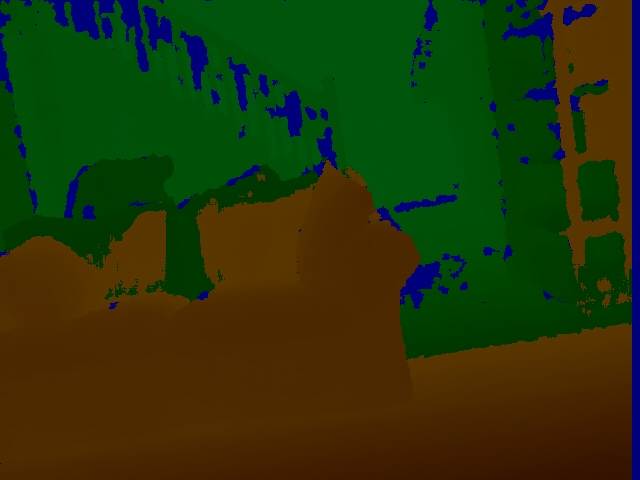
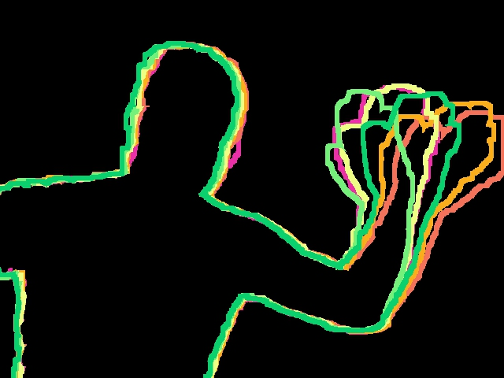

# Introduction

Mellow is a Haskell library providing a layer over
[freenect](https://github.com/chrisdone/freenect),
[friday](https://github.com/RaphaelJ/friday), and
[gloss](http://gloss.ouroborus.net/).  That is, Mellow acquires frames of 11-bit
depth information from an X-Box Kinect (360), applies the user-provided image
transformation, and renders the image to screen.

The main routine is `mellow state0 update render eventHandler` where `state0` is
the initial state, update will update the state with a new frame, `render` will
rasterize a given state for display to screen, and `eventHandler` is useful for
key presses and other inputs.

# Example

In under 20 lines we can get a pretty little OpenGL colored rendering of the
depth map.  The basic steps are:

1. Import Mellow and 'friday'.  Import 'gloss' as needed.
2. Call 'mellow' with desired call backs for receiving a new frame into your
   state, rendering the state, and handling keyboard events (see 'gloss'
   documentation for keyboard events).
3. Define your callback that transforms pixels of type @Word16@ into RGBA pixels
   using whatever techniques you desire (see the 'friday' library).

```
{-# LANGUAGE MultiWayIf #-}
import Mellow                   -- The main 'Mellow' module
import Vision.Image as I        -- The Friday library for image manipulation

main :: IO ()
main =
  mellow blackRGBA                         -- Black image to start
         (\d _ -> return (depthToRGBA d))  -- RGBA from 11-bit depth
         return                            -- Noop renders
         (defaultEventHandler return)
              -- The default event handler allows us to quit using 'esc'
              -- as well as save screen captures with 's'.

depthToRGBA :: Depth -> RGBA
depthToRGBA =
  I.map                 -- Friday image manipulation map operation
      (\val -> RGBAPixel (oper val 0 950) (oper val 800 1200) (oper val 1000 2100) 255)
  where oper v n x =
          let v' | v > x = 0
                 | v < n = 0
                 | otherwise = fromIntegral (v - n)
          in floor $ 255 * (v' / 700 :: Double)

blackRGBA :: RGBA
blackRGBA = I.fromFunction (Z :. 480 :. 640) (const (RGBAPixel 0 0 0 0))
```

# Sample Images

Depth test image of my boring living room.  See my cat everyone?  SEE MY CAT
EVERYONE!



Psychedelic Outlines (done for a birthday):


